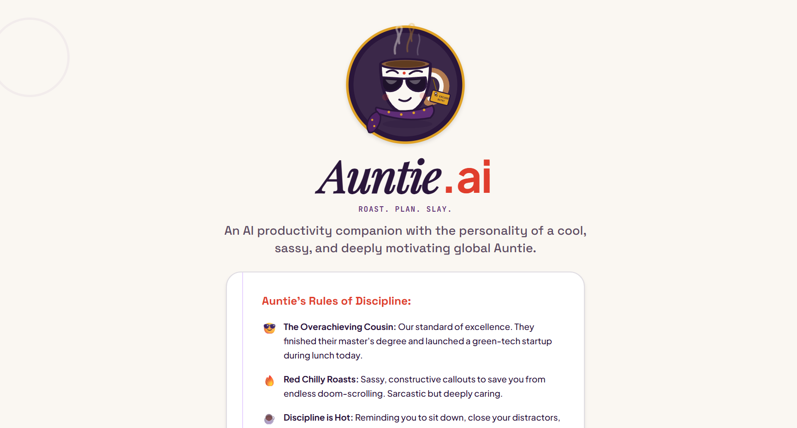
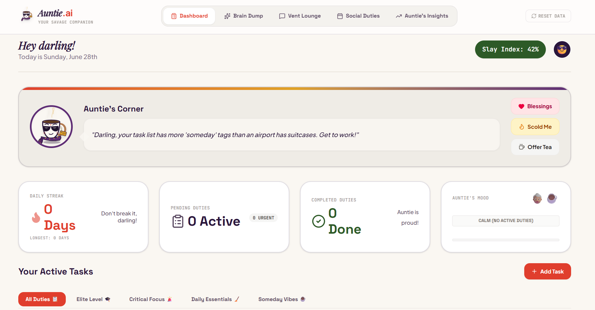
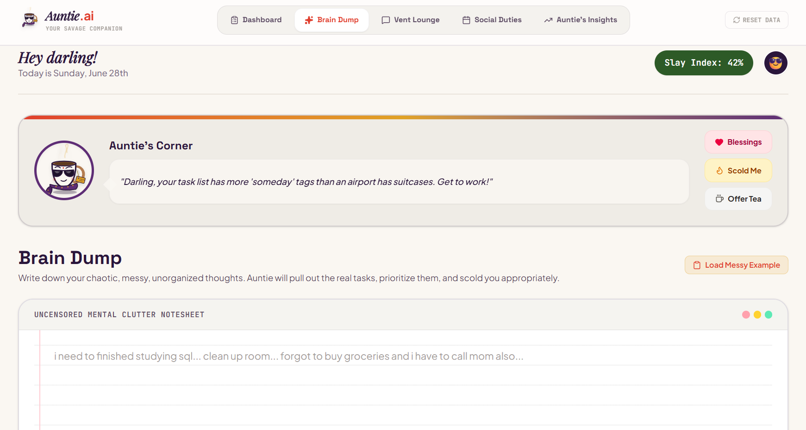
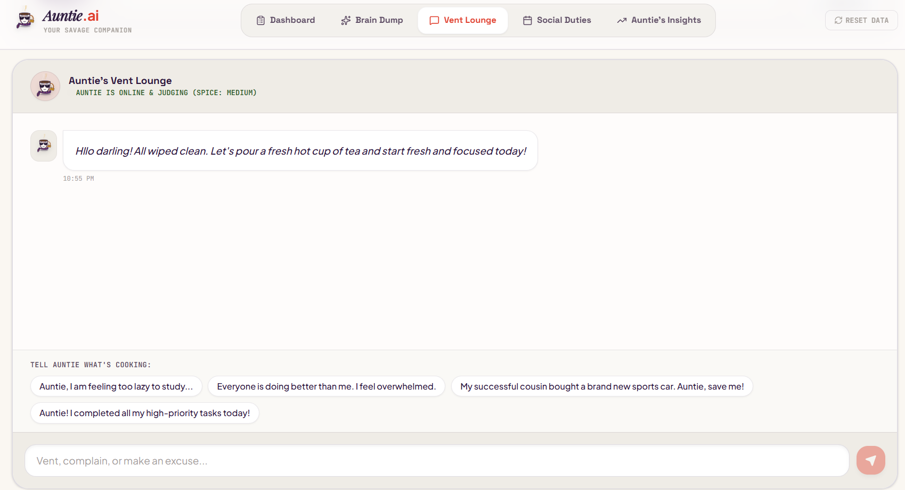
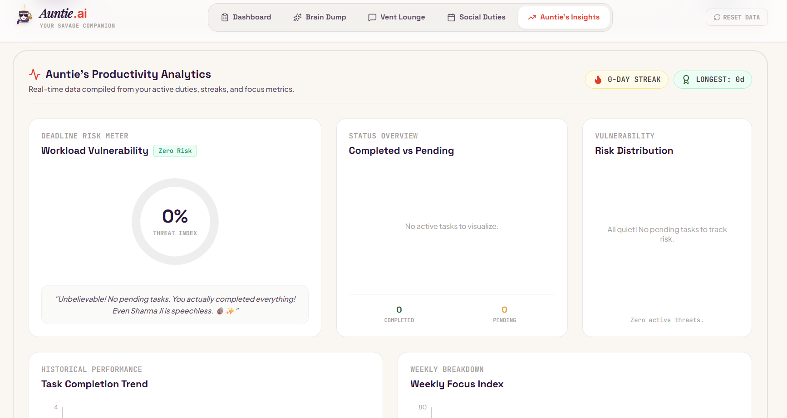

# 🫖 Auntie.ai – Roast. Plan. Slay.

> **An AI-powered productivity companion that doesn't just remind you—it helps you get things done.**

🌐 **Live Demo:** https://auntie-ai-315858824241.asia-southeast1.run.app/

---

## 📌 Problem Statement

**The Last-Minute Life Saver**

Students, professionals, and entrepreneurs often miss deadlines, assignments, interviews, bill payments, birthdays, and important commitments. Traditional productivity tools rely on passive reminders that are easy to ignore and rarely help users take meaningful action.

**Auntie.ai** transforms productivity into an interactive experience by combining Google's Gemini AI with a memorable, witty personality that organizes chaos, prioritizes work, and keeps users accountable.

---

# ✨ Features

## 🧠 Brain Dump

Forget filling out multiple forms.

Simply type everything on your mind:

* Assignments
* Exams
* Birthdays
* Interviews
* Bills
* Random thoughts
* Personal goals

Gemini intelligently extracts:

* ✅ Tasks
* ✅ Priorities
* ✅ Important dates
* ✅ Actionable plans

---

## 💬 Vent Lounge

Need to rant?

Need career advice?

Need a roadmap?

Need motivation?

Talk to Auntie naturally.

Instead of behaving like a traditional chatbot, Auntie first understands your intent, provides the correct solution, and then responds with her signature dry humor and practical advice.

---

## 📅 Smart Planner

Auntie automatically creates an actionable plan for your day by:

* Prioritizing tasks
* Organizing schedules
* Recommending what to work on next
* Helping reduce procrastination

---

## 🔥 Intelligent Task Prioritization

Instead of sorting only by deadlines, Auntie considers:

* Priority
* Urgency
* Estimated effort
* Existing workload
* Upcoming commitments

to recommend what actually deserves your attention.

---

## 🚨 Deadline Risk Meter

Each task is analyzed to estimate the likelihood of missing its deadline.

Risk levels are visualized using interactive charts, allowing users to identify critical tasks before they become emergencies.

---

## 🔄 Dynamic Rescheduling

Life changes.

Your planner should too.

Whenever tasks are skipped or new urgent work appears, Auntie automatically reorganizes your schedule and explains the reasoning behind the updated plan.

---

## 📊 Productivity Analytics

Track your productivity using interactive dashboards powered by Chart.js.

Includes:

* Task Completion Trends
* Weekly Productivity
* Deadline Risk Distribution
* Completed vs Pending Tasks
* Daily Streak Progress

---

## 🎂 Social Duties

Stay on top of important life events such as:

* Birthdays
* Important Dates
* Personal Commitments
* Social Responsibilities

Because missing your best friend's birthday hurts more than missing an assignment.

---

## 🌶️ Auntie's Personality

Auntie isn't just another AI assistant.

She is:

* witty
* sarcastic
* practical
* emotionally intelligent
* brutally honest when necessary
* supportive when it matters

She roasts excuses—not people.

---

# 🖼️ Application Preview

## Landing Page



---

## Dashboard



---

## Brain Dump



---

## Vent Lounge



---

## Productivity Analytics


---

# 🛠️ Tech Stack

### Frontend

* Next.js
* React
* TypeScript
* Tailwind CSS

### AI

* Google Gemini API
* Google AI Studio

### Visualization

* Chart.js

### State Management

* React Context

### Storage

* Local Storage

### Deployment

* Google AI Studio Build Mode
* Google Cloud Run

---

# 🚀 Getting Started

Clone the repository

```bash
git clone https://github.com/<your-username>/AuntieAI.git
```

Install dependencies

```bash
npm install
```

Create a `.env.local` file

```env
GEMINI_API_KEY=YOUR_API_KEY
```

Run locally

```bash
npm run dev
```

Open

```
http://localhost:3000
```

---

# 🌍 Deployment

The application is deployed using **Google AI Studio Build Mode** and hosted on **Google Cloud Run**. AI Studio provides a streamlined deployment workflow for full-stack applications built in Build Mode.

Live Application:

https://auntie-ai-315858824241.asia-southeast1.run.app/

---

# 💡 What Makes Auntie.ai Different?

Unlike traditional productivity tools that simply remind users about tasks, Auntie.ai actively helps users:

* Organize chaotic thoughts
* Prioritize intelligently
* Plan realistically
* Adapt schedules dynamically
* Stay accountable through personality-driven interactions

It's not just another to-do list.

It's an AI companion that helps users take action before deadlines become disasters.

---

# 👩‍💻 Built For

**Google Development + Coding Ninjas – Vibe2Ship Hackathon**

Built using **Google AI Studio** and **Google Gemini**.
